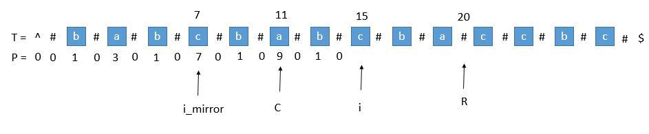

# 最长回文串-马拉车算法

说明：

1. `abcbc` 是回文字符串
2. `abccba` 也是回文字符串

常归的思路是：
```js
// 循环遍历
for (let i = 0; i < len; i++) {
  // 把 i 当成中心，算一下有多长，记录起来
  // 把 i 和 i + 1 同时当成中心，算一下有多长，记录起来 （未考虑边界条件）

  // 算下有多长，再找一个 step 就好。
  // 以 i 为中心，判断 i + step 和 i - step 是否相等，相等就 ++ ，就这样计算。
}
```
时间复杂度就是 O(n^2) 啦。

马拉车算法最核心的点是利用了回文中心对称的特点，然后以 center 为中心，去直接计算 center 右侧的值。
所以就有：`radius[center] + center = right`
或者：若 `i0 == center - (i - center)`，那么 `radius[i] == radius[i0]`

为了方便处理，会对字符串进行预处理：

```js
  // 预处理字符串
  const processedStr = `#${str.split('').join('#')}#`;
```

这样就解决了 以 i 为中心 和 以 i、i+1 同时为中心的情况。因为这样就可以简化为奇数长度，那就只要直接遍历就好。

然后需要用 `radius` 数组记录第 i 个字符的回文半径长度，记作 `radius[i]`，并把每一个 radius 元素都初始化为 0

```js
  // 初始化数组
  const len = processedStr.length;
  const radius = new Array(len).fill(0);
```

并初始化 center 和 right，分别表示当前回文串的中心的 index 和 当前回文串右边界的 index

```js
  let center = 0; // 当前回文串中心
  let right = 0; // 当前回文串右边界
```

然后就可以遍历了。

要利用回文的中心对称，有个前提就是：i 的位置要在 center 和 right 之间。所以在遍历的时候，要满足：
`right > i` 才行；

```js
  // 根据回文性质推导出 radius[i] 的初始值
  if (right > i) {
    radius[i] = Math.min(right - i, radius[2 * center - i]);
  }
```

为什么不是直接让：
```js
radius[i] = radius[2 * center - i]; // 提示：2 * center - i === center - (center - i)
```
因为：

如果此时 `radius[i]` 直接为 7 的话，那么 `i + radius[i]` 就 > R 了，这时候所谓的回文串变成了 `babcbac`，这显然是不对的。所以要取一个最小值，不能 > R.

下一步，就是不管 `radius[i]` 的值是否能用对称计算得到的，我们都要尝试对 `radius[i]` 的半径进行扩展。

```js
  // 针对 i 为中心位置，尝试扩展半径
  while (processedStr[i + radius[i] + 1] === processedStr[i - radius[i] - 1]) {
    radius[i]++; // 半径加 1
  }
```

经过扩展之后，再下一步就是对比一下当前中心的半径是不是比原来的大，是的话，则需要更新回文串的中心和右边界。方便后面进一步利用对称去计算；

```js
  // 更新当前回文串中心和右边界
  if (i + radius[i] > right) {
    center = i;
    right = i + radius[i];
  }
```

参考：https://blog.crimx.com/2017/07/06/manachers-algorithm/

